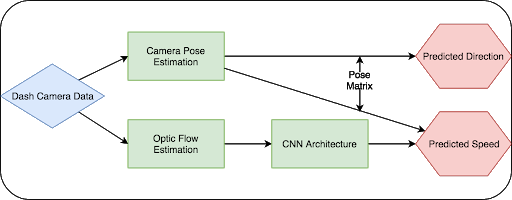
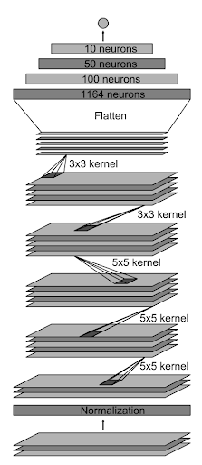

# Vehicle-motion-based-on-vision
Estimate the vehicle motion based on vision cue: optic flow and pose estimation 

# Introduction
## Why estimating vehicle motion?

1.Self-driving as a promising new technology
2.Developments made over the years 
3.Existing various optical flow estimation algorithm

 

Currently there are many algorithms regarding optical flow in self driving.
We want to improve classical methods so that it is more resistant to noise caused by weather and other environmental issues.

## Downloads
1.The total dataset is available by group 20. The demo datasets is available [here](https://drive.google.com/drive/folders/1YfMFW4fw-rsQv0VJ2Nfmcs1w4k_0Ecf0?usp=sharing)

## Example Code
There is an example data segment in this repo for experimentation. There are also some notebooks with some example code. Including a position benchmark. Make sure to `pip install -r requirements.txt` if you do not have the relevant packages installed already.
The examples contain a 1 minute sample segment and some sample notebooks.
* Lucas-Kanade naive method implementation
* Pyramidal Lucas-Kanade Optical Flow overlay on CNN architecture -- 3 Dimensional parameter into CNN
* Sublinear Optical Flow Algorithm on CNN architecture -- 3 Dimensional parameter into CNN
* Five image cue differences on CNN architecture -- 5 Dimensional parameter into CNN

## Dataset loading 
Structure
The ideas is to split the video sources into individual picture frame and use csv file to store its speed at a particular speed. 
csv-files
|
|
+-- images-paths
    |
    speed@frame
    
    
 # Methodlogy
 ## Five architecture to compare
 ### sparse optical methods
 1.Forward wrapping
 2.Lucas-Kanade Optical Flow

 ### Dense optical methods (Use speed CNN architechture)
 1. Pyrimid Lucas-Kanade Optical Flow overlay -- 3 Dimensional parameter
    
 2. Sublinear Optical Flow Algorithm -- 3 Dimensional parameter
 
 3. Five image cue differences -- 5 Dimensional parameter
    
 ### The Flow chart for our pipeline
  

 ### The architecture of speed CNN
   
  
  The network has about 27 million connections and 250 thousand parameters.

# reference 
thanks to comma.ai
https://www.digitaltrends.com/cars/commaai-self-driving-retrofit-software-free/

        

