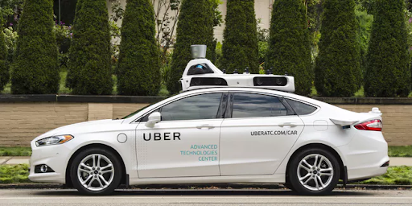

# Vehicle-motion-based-on-vision
Estimate the vehicle motion based on vision cue: optic flow and pose estimation 

# Introduction
## Why estimating vehicle motion?

1.Self-driving as a promising new technology
2.Developments made over the years 
3.Existing various optical flow estimation algorithm

 

Currently there are many algorithms regarding optical flow in self driving.
We want to improve classical methods so that it is more resistant to noise caused by weather and other environmental issues.

## Downloads
1.The total dataset is ~100GB and can be downloaded [here](http://academictorrents.com/details/65a2fbc964078aff62076ff4e103f18b951c5ddb) It is divided into ~10GB chunks.

## Example Code
There is an example data segment in this repo for experimentation. There are also some notebooks with some example code. Including a position benchmark. This code has only been tested on python 2.x and ubuntu 16.04. Make sure to `pip install -r requirements.txt` if you do not have the relevant packages installed already.
The examples contain a 1 minute sample segment and some sample notebooks.
* processed_readers: some examples of data reading and plotting
* position_benchmarks: example of running the position benchmark used to evaluate fix quality
* raw_readers: example of using [openpilot_tools](https://github.com/commaai/openpilot-tools)

For examples related to raw GNSS please check out [Laika](https://github.com/commaai/laika)

## Dataset Structure

